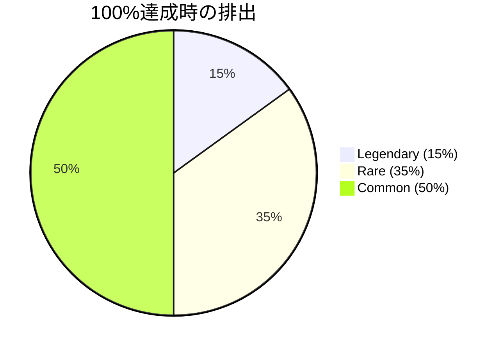

# HypoLab - 仮説検証プラットフォーム（ローカル版）

仮説を立て、ランダムに決められた期間で楽しく検証する習慣形成支援ツール。現在はローカルストレージのみを利用するローカル版のみを提供しています（Firebase版は廃止）。

## 🎯 概要

HypoLabは、日々の習慣や行動改善の仮説を立て、ゲーミフィケーション要素を取り入れながら楽しく検証できるシングルページのWebアプリです。検証期間をランダムに決定することで、マンネリ化を防ぎ、継続的な習慣形成をサポートします。データはブラウザ内（ローカルストレージ）に保存されます。

## ✨ 主な機能

- 🧪 仮説立案・管理（タイトル/説明/期限/成功指標）
- 🎲 期間のランダム決定とカード的要素
- 📊 進捗トラッキングと可視化
- 🎉 完了・継続・修正などのアクション管理
- 📚 履歴の振り返り

## 🛠️ 技術スタック

- フロントエンド: HTML5, CSS3, Vanilla JavaScript（依存フレームワークなし）
- データ保存: ブラウザのローカルストレージ
- UI/UX: ダークテーマ、レスポンシブ、PWA的な使い心地

## 🚀 使い方（ローカル）

1. リポジトリをクローン
```bash
git clone https://github.com/Yusuke0018/PDCA-Lab.git
cd PDCA-Lab
```
2. ブラウザで `hypolab-local.html` を開く（ダブルクリックまたは任意の静的サーバで配信）
   - 例: Pythonの簡易サーバ
     ```bash
     python3 -m http.server 8080
     # http://localhost:8080/hypolab-local.html を開く
     ```

## 🎴 カード要約

- 取得条件:
  - 100%達成: 報酬カード1枚（レア以上50%: L15%/R35%/C50%）
  - 80–99%: 報酬カード1枚（レア20%/コモン80%）
  - 60–79%: なし / 0–59%: ペナルティ1枚
- 主な報酬カード:
  - スキップチケット: 過去/今日の任意1日を達成扱い
  - 達成ブースト: 今日を含む3日を自動達成（各仮説1回）
  - 達成率ブースター: 最終達成率に+15%
  - パーフェクトボーナス: 次の仮説で100%達成時、合計2枚（通常1+追加1）
- 主なペナルティ:
  - 短期集中: 次の仮説は短期間3–5日に固定
  - ハードモード: 90%未満はカード獲得なし
  - リセットリスク: 3日連続未達成で全達成をリセット
  - 混乱の渦: 達成/未達成がランダムで3日分反転
  - ダブルオアナッシング: 次の仮説で100%未達ならペナルティ2枚

詳細は `CARD_SYSTEM_DETAILED.md` とコンセプトは `CARD_SYSTEM_CONCEPT.md` を参照してください。

## 🖼️ スクリーンショット（参考）

> 画像は仮のパスです。`docs/images/` 配下に配置すると自動で表示されます。

- ホーム画面: 
- 新規仮説作成: 
- 進捗画面（カレンダー）: 
- カードコレクション: 

## 📊 カード確率（図示）

100%達成時の排出分布（現行実装）



80–99%達成時: Rare 20% / Common 80%（レジェンダリーは無し）

0–59%達成時（ペナルティ）: Common 40% / Rare 60%（現在の実装では common=延長/短期集中/達成率減少、rare=ハード/リセット）

## ❓よくある質問（FAQ）

- Q. データはどこに保存されますか？
  - A. ブラウザのローカルストレージに保存されます。ブラウザのキャッシュ削除やシークレットモードでは消えることがあります。

- Q. データのバックアップ/復元はできますか？
  - A. 近日、JSONエクスポート/インポート機能を追加予定です。それまでの間は開発者ツールから `localStorage['hypolab_local_data']` をコピーして保存できます。

- Q. 以前のFirebase版と何が違いますか？
  - A. 現在はローカルのみで完結し、ログイン/同期はありません。高速に試行でき、オフラインでも使えます。

- Q. カードはどの画面で使えますか？
  - A. 進捗画面の「カードを使用」から使用可能な報酬カードを選べます。使用条件（例: 達成ブーストは残り3日以上、各仮説1回など）に注意してください。

- Q. 短期集中などのペナルティはどのタイミングで適用されますか？
  - A. 次の仮説作成時に自動適用され、シャッフル前に警告表示のうえ効果が消費されます。

## 📦 デプロイ（任意）

静的ホスティング（GitHub Pages など）に `hypolab-local.html` を配置するだけで動作します。

## 🔧 今後の開発予定

- [ ] Serena MCPとの統合による高度な分析
- [ ] AIによる仮説立案サポート
- [ ] チーム/共有機能（ローカル前提の軽量同期案）
- [ ] 詳細な統計・分析、エクスポート（CSV/PDF）
- [ ] リマインダー通知

## 📄 ライセンス

MIT License

## 👤 作者

Yusuke0018

## 🤝 コントリビューション

不具合報告や改善提案を歓迎します。大きな変更の前にIssueで相談してください。
